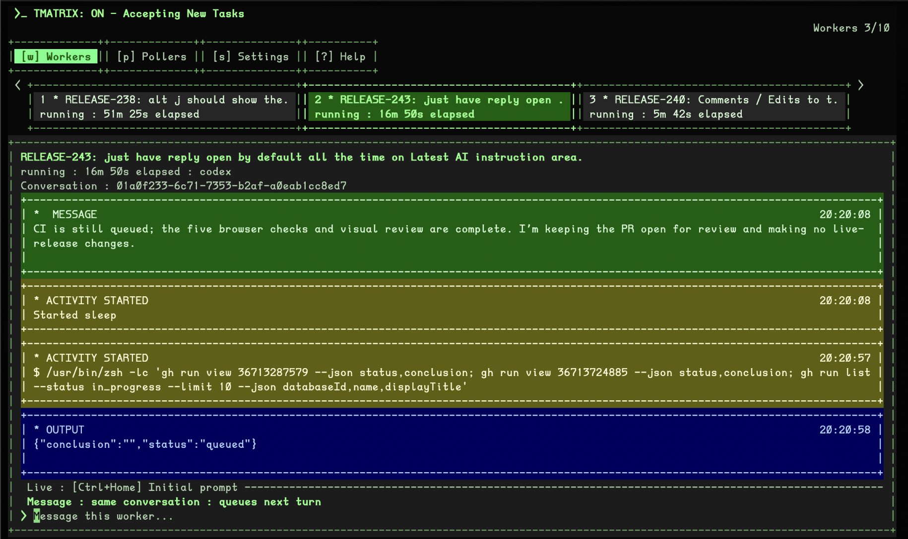

# TMatrix

Use your own AI subscriptions, computers and models to add AI powers to supported apps.

Save money since AI subscriptions are cheaper, your own computers are already paid for (vs expensive cloud servers).
Furthermore the models you pay for are possibly more powerful, and you already pay for them so may as well use them.

Concept:
- Your computer runs TMatrix app, this app, which is very easy to install/uninstall.
- TMatrix orchestraters tasks, pollers and workers.
- A **poller** gets tasks from a **source** like tzudo.app.
- An **AI worker** works on those tasks, a worker can be something like Codex.
- This goes on until the number of workers limit is reached. You can set the max # yourself.

---

Created for [Tzudo](https://tzudo.app/), the ultimate to do list and time tracker to 10x your productivity and work stress-free.

Codex adapter included.

Im not using Claude this month, so I may not work on a Claude adapter until I get back to using it.



## Quick install

Mac, Linux, or Windows WSL:

```sh
curl -fsSL https://github.com/xmarkclx/tmatrix/releases/latest/download/install.sh | sh
```

On macOS, the installer reuses compatible Node.js/npm installations.
Missing or outdated Node.js/npm are installed through Homebrew; if Homebrew is
missing, its official installer runs first and may request administrator access
or Command Line Tools. The installer selects the installed runtimes for setup
and saves their paths for future terminals. No TypeScript compiler is needed.
Homebrew must support your macOS version and hardware.

Linux/WSL still requires Node.js 20.19 or 22.12+ and npm to be installed
beforehand. Installing and running TMatrix does not require Python.

Worktree conventions come from task and repository instructions. TMatrix does not
inject a checkout workflow, allocate worktrees, or manage their cleanup. Existing
checkouts and recovery archives are left untouched. Task execution ownership,
cancellation confirmation, and draining remain enforced by the engine. Previously
started conversations may still contain the old worktree instructions in their
history; removing the workflow does not rewrite that history.

Python is still used by contributor release and test scripts; it is not shipped
as a runtime dependency.

- Connect using your TzuDo API key on https://tzudo.app/settings.
- Currently only supports Codex for now. Claude Code Integration is on the roadmap.

**Uninstalling** 
Removes the daemon and tmatrix command from path:

```sh
tmatrix service uninstall && rm -f "$HOME/.local/bin/tmatrix"
```

# Security Recommendations
- Best to run on its own secure environment like on a VM.
- Turn off / pause intake when not being used.

For an installed app and background daemon, see [Install on Mac or Windows](#releases-and-installation). To remove login startup later, see [Uninstall the daemon](#uninstall-the-daemon).

